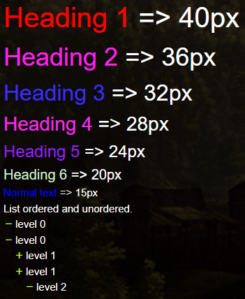
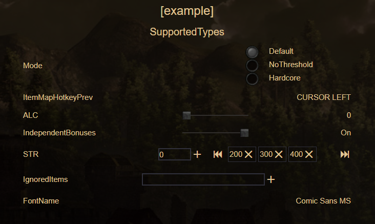

# G3 ModStarter
Mod manager for Gothic 3.

### Tech stack

<p >


</p>
<p>


</p>

### Development

- Using the npm script `watch`: Application is started in `development mode` with access to debug window and is automatically hot-reloaded for the `Main` and `Renderer` processes.
- Using the npm script `compile`: This script is configured to compile the application as quickly as possible. It is not ready for distribution, it is compiled only for debugging.
- Using GitHub Actions: The application is compiled and ready-to-distribute files are automatically added as a draft to the GitHub releases page.

### Publishing
Each time you push changes to the `main` branch, the [`release`](.github/workflows/release.yml) workflow starts, which creates a new draft release. For each next commit will be created and replaced artifacts. That way you will always have draft with latest artifacts, and the release can be published once it is ready. 

**Auto-update is supported**. After the release is published, all client applications will download the new version and install updates silently.


### Mod.json structure
```
{
  "id": "Mod", // Must be unique. Used by dependecies, incompatibles and presets.
  "title": "Mod", // Name displayed in starter.
  "authors": ["Author1", "Author2"],
  "dependencies": ["Mod2", "Mod3"], // Uses mod id to automaticly select required mods.
  "incompatibles": ["Mod4"], // Uses mod id to disable selecting of incompatible mods.
  "category": "Balance" // Used to filter mods by category.
}
```

### Readme_(lang).md
Based on the currently selected language, the corresponding file will be loaded.
Supported languages:
`Polish -> readme_pl.md`
`English -> readme_gb.md`
`Russian -> readme_ru.md`
`German -> readme_de.md`

##### Readme files can be customized.
<p align="center">

</p>

```
{color}(content to color)
# {red}(Heading 1)          => 40px
## {#ff22ee}(Heading 2)     => 36px
### {#3f2fee}(Heading 3)    => 32px
#### {#fa2dee}(Heading 4)   => 28px
##### {#9921ec}(Heading 5)  => 24px
###### {#cceecc}(Heading 6) => 20px
{blue}(Normal text)         => 15px

List ordered and unordered.
- level 0
- level 0
  - level 1
  - level 1
    - level 2
    - level 2

1. level 0
1. level 0
    1. level 1
    1. level 1

Others
**bold**    
__bold__    
*italics*    
_italics_    
***bold and italics***
~~text crossed out~~
```

### Script configuration
Correctly defined config shows in Options window.
<p align="center">

</p>

```
[ExampleSection]
Option=Value
; Description content, \n - new line separator
; type, DefaultValue
; Optional line only for mode and number

[SupportedTypes]
Mode=Default
; Description content, \n - new line separator, last line is list of options
; mode, Default
; Default|NoThreshold|Hardcore
ItemMapHotkeyPrev=CURSOR LEFT
; Description content, \n - new line separator
; key, CURSOR LEFT
ALC=0
; Description content, \n - new line separator, last line is for MIN|MAX|STEP values
; number, 0
; 0|100
IndependentBonuses=true
; Description content, \n - new line separator
; boolean, true
STR=200;300;400
; Description content, \n - new line separator
; array, arrayType:number, 200;300;400
IgnoredItems=It_Bradley_SlaveList;It_Brandon_Name
; Description content, \n - new line separator
; array, arrayType:string, It_Bradley_SlaveList;It_Brandon_Name
FontName=Comic Sans MS
; Description content, \n - new line separator
; string, Comic Sans MS
```

### Presets

Presets are loaded from ```Gothic 3/presets``` folder.

##### preset.json (Required)
```
{
  "name":"Preset1",
  "modIds":[ "Mod1", "Mod2", "Mod3"]
}
```

##### Shader.Cache (Optional)
If ```Shader.Cache``` file exists in preset directory it will be copied into ```documents/gothic3``` folder to skip shader compilation process.
##### splash.bmp (Optional)
If ```splash.bmp``` file exists in preset directory it will be copied into ```Gothic 3``` game folder to replace original image.
